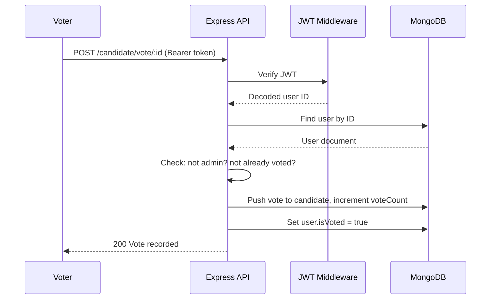
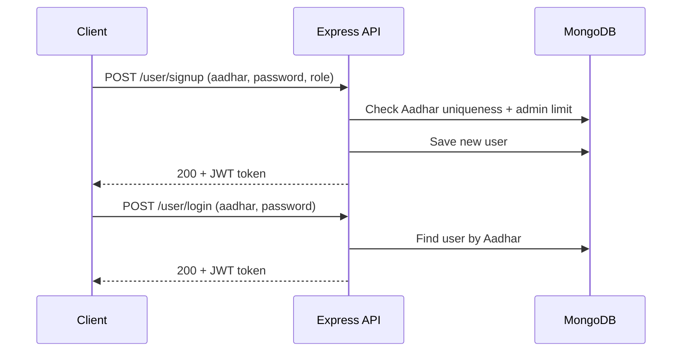

# Voting App — Backend API

A RESTful backend API for an online voting system built with Node.js, Express, and MongoDB. Supports voter/admin registration with Aadhar-based identity verification, JWT authentication, candidate management, and fair election enforcement (one vote per user, no admin voting).

---

## Overview

The Voting App solves the problem of running a simple, fair online election. Users register with their 12-digit Aadhar Card Number and choose a role — **voter** or **admin**. Admins manage the candidate roster (add, update, delete). Voters authenticate and cast exactly one vote. The system prevents duplicate votes, blocks admins from voting, and exposes a live results endpoint sorted by vote count.

### Workflow

1. **Admin registers** (only one admin allowed system-wide) and creates candidates.
2. **Voters register** with unique Aadhar Card Numbers.
3. **Voters log in**, receive a JWT token, and cast their vote for a candidate.
4. **Results are publicly accessible** — candidates ranked by vote count in descending order.

---

## Key Features

### Authentication & Authorization
- JWT-based stateless authentication with `Bearer` token scheme
- Role-based access control (RBAC) with two roles: `voter` and `admin`
- Single-admin constraint — only one admin account can exist in the system
- Aadhar Card Number validation (exactly 12 digits, unique per user)

### Election Integrity
- One-vote-per-user enforcement via `isVoted` flag on the User model
- Admins are explicitly blocked from voting
- Dual-layer vote tracking: per-user flag + per-candidate vote log with timestamps

### Candidate Management
- Full CRUD operations for candidates (admin-only)
- Each candidate has a name, party affiliation, and age
- Vote count maintained directly on the candidate document for fast reads

### Live Results
- Public endpoint returning all candidates sorted by vote count (descending)
- No authentication required — results are open to everyone

### Profile Management
- Authenticated users can view and update their own profile

---

## Architecture

```mermaid
graph TB
    Client[Client / Postman / curl] -->|HTTP| Server[Express Server]
    Server -->|Mounts| UserRoutes[/user routes]
    Server -->|Mounts| CandidateRoutes[/candidate routes]
    UserRoutes -->|Uses| JWT[JWT Middleware]
    CandidateRoutes -->|Uses| JWT
    UserRoutes -->|Queries| UserModel[(User Model)]
    CandidateRoutes -->|Queries| CandidateModel[(Candidate Model)]
    UserModel -->|Mongoose| MongoDB[(MongoDB)]
    CandidateModel -->|Mongoose| MongoDB
    JWT -->|Verifies| JWT_SECRET[JWT_SECRET env var]
```

### Request Flow — Voting



### Request Flow — Authentication



---

## Technology Stack

| Category       | Technology              | Version  | Purpose                          |
|----------------|-------------------------|----------|----------------------------------|
| **Runtime**    | Node.js                 | v18+     | JavaScript runtime               |
| **Framework**  | Express                 | ^5.2.1   | HTTP server and routing          |
| **Database**   | MongoDB                 | —        | Document store                   |
| **ODM**        | Mongoose                | ^9.7.3   | Schema modeling and queries      |
| **Auth**       | jsonwebtoken            | ^9.0.3   | JWT signing and verification     |
| **Security**   | bcrypt                  | ^6.0.0   | Password hashing (installed, not yet wired) |
| **Middleware** | cors                    | ^2.8.6   | Cross-origin request handling    |
| **Middleware** | body-parser             | ^2.3.0   | JSON request body parsing        |
| **Config**     | dotenv                  | ^17.4.2  | Environment variable loading     |
| **Modules**    | CommonJS                | —        | `require` / `module.exports`     |

---

## Project Structure

```
voting/
├── models/
│   ├── user.js              # User schema — name, age, aadhar, password, role, isVoted
│   └── candidate.js         # Candidate schema — name, party, age, votes[], voteCount
├── routes/
│   ├── userRoutes.js        # Signup, login, profile view/edit endpoints
│   └── candidateRoutes.js   # Candidate CRUD + voting + live results endpoints
├── db.js                    # MongoDB connection setup via Mongoose
├── jwt.js                   # JWT auth middleware + token generation utility
├── server.js                # Express app entry point — middleware, route mounting, listener
├── temp.js                  # Development artifact (unused duplicate of userRoutes.js)
├── package.json             # Dependencies and project metadata
└── .env                     # Environment variables (not committed)
```

### Key Files

| File                     | Responsibility                                                  |
|--------------------------|-----------------------------------------------------------------|
| `server.js`              | Creates Express app, configures CORS/body-parser, mounts routes, starts listener |
| `db.js`                  | Establishes MongoDB connection, logs connection lifecycle events |
| `jwt.js`                 | Exports `jwtAuthMiddleware` (verifies Bearer tokens) and `generateToken` (signs JWTs with 30000s expiry) |
| `models/user.js`         | Mongoose schema for users with role enum, Aadhar uniqueness, isVoted flag |
| `models/candidate.js`    | Mongoose schema for candidates with embedded votes array and voteCount |
| `routes/userRoutes.js`   | Handles signup (with admin limit + Aadhar validation), login, profile CRUD |
| `routes/candidateRoutes.js` | Handles candidate CRUD (admin-only), vote casting (voter-only), live results |

---

## Installation & Setup

### Prerequisites

- **Node.js** v18 or later — [Download](https://nodejs.org/)
- **MongoDB** running locally or a remote connection string (e.g., MongoDB Atlas)

### Steps

```bash
# 1. Clone the repository
git clone https://github.com/ralon-1/voting.git
cd voting

# 2. Install dependencies
npm install

# 3. Create environment configuration
```

Create a `.env` file in the project root:

```env
PORT=3000
MONGODB_URL_LOCAL=mongodb://127.0.0.1:27017/voting_app
JWT_SECRET=your_secret_key_here
```

| Variable             | Description                                        | Default  |
|----------------------|----------------------------------------------------|----------|
| `PORT`               | Port the server listens on                         | `3000`   |
| `MONGODB_URL_LOCAL`  | MongoDB connection string                          | —        |
| `JWT_SECRET`         | Secret key for signing and verifying JWT tokens    | —        |

```bash
# 4. Start the server
node server.js
```

The API will be available at `http://localhost:3000`.

---

## Usage

### Authentication Header

All protected routes require:

```
Authorization: Bearer <your_jwt_token>
```

### User Endpoints

**Sign up a voter:**
```bash
curl -X POST http://localhost:3000/user/signup \
  -H "Content-Type: application/json" \
  -d '{
    "name": "Jane Doe",
    "age": 28,
    "address": "123 Main St",
    "aadharCardNumber": "123456789012",
    "password": "secret123",
    "role": "voter"
  }'
```

**Log in:**
```bash
curl -X POST http://localhost:3000/user/login \
  -H "Content-Type: application/json" \
  -d '{
    "aadharCardNumber": "123456789012",
    "password": "secret123"
  }'
```

**Get profile (authenticated):**
```bash
curl http://localhost:3000/user/profile \
  -H "Authorization: Bearer <token>"
```

### Candidate Endpoints

**Add candidate (admin only):**
```bash
curl -X POST http://localhost:3000/candidate \
  -H "Content-Type: application/json" \
  -H "Authorization: Bearer <admin_token>" \
  -d '{"name": "Alex Kumar", "party": "Independent", "age": 45}'
```

**List all candidates:**
```bash
curl http://localhost:3000/candidate
```

**Cast a vote (voter only):**
```bash
curl -X POST http://localhost:3000/candidate/vote/<candidate_id> \
  -H "Authorization: Bearer <voter_token>"
```

**View live results:**
```bash
curl http://localhost:3000/candidate/vote
```

---

## API Reference

### User Routes (`/user`)

| Method | Endpoint             | Auth | Description                                      |
|--------|----------------------|------|--------------------------------------------------|
| POST   | `/user/signup`       | No   | Register a new voter or admin                    |
| POST   | `/user/login`        | No   | Log in with Aadhar number and password           |
| GET    | `/user/profile`      | Yes  | Get the authenticated user's profile             |
| POST   | `/user/profile/edit` | Yes  | Update the authenticated user's profile          |

**Signup rules:**
- `aadharCardNumber` must be exactly 12 digits and unique across all users
- Only one user with `role: "admin"` can exist
- Returns a JWT token on success

### Candidate Routes (`/candidate`)

| Method | Endpoint                      | Auth | Role   | Description                              |
|--------|-------------------------------|------|--------|------------------------------------------|
| GET    | `/candidate`                  | No   | —      | List all candidates                      |
| POST   | `/candidate`                  | Yes  | admin  | Add a new candidate                      |
| PUT    | `/candidate/:candidateID`     | Yes  | admin  | Update a candidate's details             |
| DELETE | `/candidate/:candidateID`     | Yes  | admin  | Delete a candidate                       |
| POST   | `/candidate/vote/:candidateID`| Yes  | voter  | Cast a vote for a candidate              |
| GET    | `/candidate/vote`             | No   | —      | Live results sorted by vote count        |

**Voting rules:**
- Admins cannot vote
- Each voter can vote only once
- Returns `404` if candidate or user not found

---

## Database Schema

### User Collection

```
{
  name:             String (required)
  age:              Number (required)
  email:            String (optional)
  mobile:           String (optional)
  address:          String (required)
  aadharCardNumber: Number (required, unique)
  password:         String (required)
  role:             String — "voter" | "admin" (default: "voter")
  isVoted:          Boolean (default: false)
}
```

### Candidate Collection

```
{
  name:       String (required)
  party:      String (required)
  age:        Number (required)
  votes: [
    {
      user:     ObjectId → User (required)
      votedAt:  Date (default: Date.now)
    }
  ]
  voteCount:  Number (default: 0)
}
```

---

## Engineering Decisions

**Dual vote tracking.** Votes are recorded in two places: the `candidate.votes` array (audit trail with user ID and timestamp) and the `candidate.voteCount` denormalized counter (fast reads for results). The `user.isVoted` flag provides a third check at the user level.

**Single-admin constraint.** Enforced at the application layer during signup — the route checks for an existing admin before allowing registration with `role: "admin"`.

**JWT with 30000-second expiry.** Tokens expire after approximately 8.3 hours. No refresh token mechanism is implemented.

**Aadhar as identity.** Uses India's Aadhar Card Number (12-digit) as the unique user identifier instead of email or username, reflecting the real-world identity verification pattern.

**Express 5.** Uses Express ^5.2.1, which includes breaking changes from Express 4 (e.g., removed `app.del()`, changed `req.query` behavior, async error handling improvements).

---

## Known Limitations

| Issue | Details |
|-------|---------|
| **Plaintext passwords** | `bcrypt` is installed but not wired into the User model. Passwords are stored and compared as plain text. |
| **No password verification on login** | The login route finds the user by Aadhar but the password comparison is commented out — any password works. |
| **Aadhar type mismatch** | Schema defines `aadharCardNumber` as `Number` but routes validate it as a 12-digit string. Leading zeros would be lost. |
| **Date.now() bug** | `votedAt` default uses `Date.now()` (evaluated once at schema load) instead of `Date.now` (per-document). |
| **No input validation** | No validation middleware beyond Aadhar regex — missing checks on name, age, party, etc. |
| **No rate limiting** | Login and voting endpoints have no brute-force protection. |
| **No tests** | No test files or test framework dependencies. |
| **temp.js artifact** | Unused duplicate of userRoutes.js sitting in the project root. |

---

## Roadmap

- [ ] Wire bcrypt password hashing into User model (pre-save hook + comparePassword method)
- [ ] Fix login route to actually verify passwords
- [ ] Add input validation middleware (express-validator or zod)
- [ ] Implement refresh tokens and token expiry handling
- [ ] Add rate limiting on auth and voting endpoints
- [ ] Write automated tests with Jest and Supertest
- [ ] Add Dockerfile for containerized deployment
- [ ] Fix AadharCardNumber schema type to String
- [ ] Fix `Date.now()` default in candidate votes
- [ ] Remove temp.js artifact

---

## What This Project Demonstrates

**REST API Design.** Clean resource-based routing with proper HTTP methods (GET, POST, PUT, DELETE) and status codes.

**Authentication & Authorization.** JWT-based stateless auth with role-based access control — middleware pattern for reusable auth checks.

**Database Modeling.** Mongoose schemas with embedded documents (votes array), denormalized counters (voteCount), and uniqueness constraints.

**Election Integrity Logic.** Business rules enforced at the application layer — one-vote-per-user, single-admin constraint, admin-voting prevention.

**Express Middleware Patterns.** Composable middleware for CORS, body parsing, and JWT verification applied at the route level.

**Environment Configuration.** Dotenv-based config separation for secrets and connection strings.

---

## License

ISC
